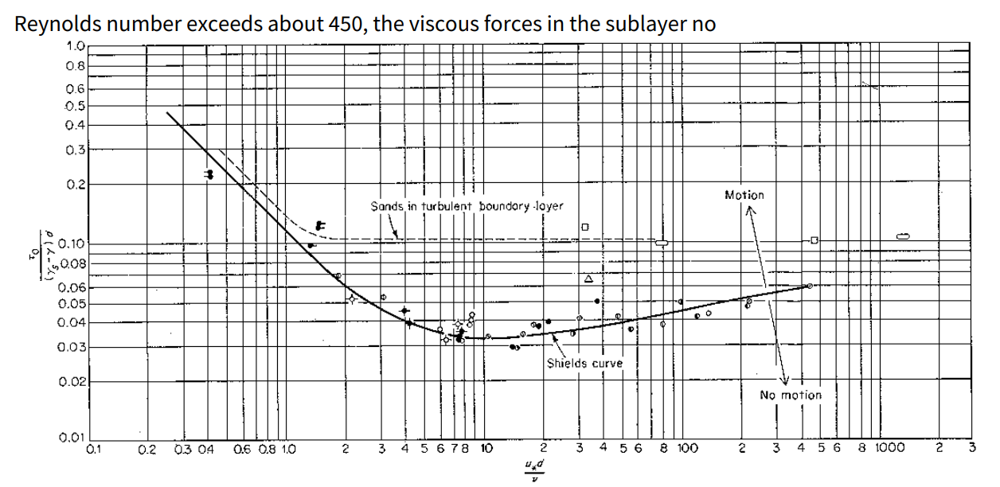
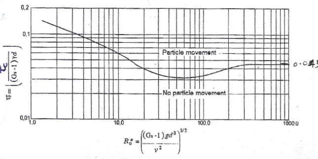

# About Design Criteria
[Back to Home](..\Index#online-documentation)

Establishing a set of design criteria is the basis of design work. These data are also the key input data for tackling the sizing and detailing of a network of canal system in CanalNETWORK.

Design criteria in CanalNETWORK, specifically refer to a list of parameters that defined and set to a specific value correponding to the design task required. This parameter list is constantly refered to by numerous design tasks, with out the need for the user to input data every now and then. 

> Note: As parameters in Design Criteria set are constantly refered to in the design process, it is IMPORTANT to spend adequate time to set values. This will save significant time later.

## Table of Contents
<!--TOC-->
  - [Detail Definition of Design Criteria Parameters](#detail-definition-of-design-criteria-parameters)
    - [CBL Design Settings](#cbl-design-settings)
      - [Prefered/ Max Drop Height(m):](#prefered-max-drop-heightm)
      - [Minimum Drop Height(m):](#minimum-drop-heightm)
      - [Min. Control Spacing (m):](#min.-control-spacing-m)
      - [Fit Height](#fit-height)
      - [FIt Type](#fit-type)
    - [Command Criteria](#command-criteria)
      - [Canal Duty (l/sec/ha)](#canal-duty-lsecha)
      - [Min FSL-OGL @ Controls(m)](#min-fsl-ogl-controlsm)
      - [FSL-OGL Control type](#fsl-ogl-control-type)
      - [Min FSL-OGL @Reach(m)](#min-fsl-ogl-reachm)
      - [Min Drv. Head @Control(m)](#min-drv.-head-controlm)
      - [Branch Invert Raise (-):](#branch-invert-raise-)
    - [Construction Variables](#construction-variables)
      - [Canal Lining type, Ltyp(-)](#canal-lining-type-ltyp-)
      - [Lining Thickness, Thk(m)](#lining-thickness-thkm)
      - [Foundation Thickness, THK(m)](#foundation-thickness-thkm)
      - [Earth cut shape, Smc(-)](#earth-cut-shape-smc-)
      - [Earth fill shape, Smf(-)](#earth-fill-shape-smf-)
      - [Complex Cut and Fill Shapes](#complex-cut-and-fill-shapes)
    - [Hydraulic Design](#hydraulic-design)
      - [Min. Design Discharge(m3/sec)](#min.-design-dischargem3sec)
      - [Design B to D ratio(-)](#design-b-to-d-ratio-)
      - [Limiting Velocity(m/sec)](#limiting-velocitymsec)
      - [Max. All. Shear Stress (Kg/m2)](#max.-all.-shear-stress-kgm2)
      - [Mannings Roughness, N(-)](#mannings-roughness-n-)
      - [Freeboard, FB(m)](#freeboard-fbm)
      - [Canal Side Slope, m(-)](#canal-side-slope-m-)
      - [Bed Slope, So(m/m)](#bed-slope-somm)
    - [[NEW] Canal Bed Material](#new-canal-bed-material)
- [Default Criteria values for different canal Levels](#default-criteria-values-for-different-canal-levels)
- [Technical Notes on Stable Canals Design](#technical-notes-on-stable-canals-design)
<!--/TOC-->## Contents of Design Criteria Set
[Back to ToC](#table-of-contents)

The following groups of criteria set are defined and available in the software:

1. CBL Design Settings: These parameters are used to dictate the placement (position) and size of drops when creating canal bed level design information.

2. Command Criteria: The parametrs in this group determine commanding variables related to the supply and distribution of water in the network.

3. Construction Variables: These parameters define the assembly information for canal sections to be used when creating cut and fill section geometries.

4. Hydraulic Design Variables: As in above, these parameters set design specifications for the geometrical shape and size of the flow section to be used for water conveyance.

These groups of parameters are carefully set for each level of canal that may exist in the project. In a typical project, for instance, MC, SC, TC, QC and FC may exist. For such a project, there are five levels (or generations) of canals, and each level is provided a separate set of values for the above group of parametrs.

## Detail Definition of Design Criteria Parameters
[Back to ToC](#table-of-contents)

Before diving in to detail discussion of parametrs and their meaning, it is worth while to understand the concept of controls.

Controls are points along a canal route that may represent a phyisical structure (e.g., turnout, division box) or a theoretical control point which is known to result in a change of either hydraulic parameter, geometrical shape of canal section, or other. As such, controls define segments of a canal route. Each segment is therefore comprised of well known and fixed hydraulic and geometrical paramters.

In the sample network of canals shown below, the MC canal feeds four sub canals. Therefore, the branch locaitons represent a physical control point. As can be seen in the correponding profile view, these are represented by solid vertical bars. In plan view they are represented with small circles as Nodes. Such controls are automatically identified and positioned by the software.

The user can also introduce fictious controls for design purposes. This could be to change the hydraulic characterisics or the construciotn details of a canal reach. The 

Controls are built on a number of Node, and Segment Assembly parameters. These parameters represent hydraulic and geometric conditions UPSTREAM of the control. Changing a parameter on a control, therfore, affects ONLY the canal reach or segment located upstream of that control. 

In essence, therfore, design criteria values constitute the node and geometry parameters of controls in the entire network, depending on the location of the controls. The below sections present a detailed desctiption of each parameter in the design criteria set, and discuss how they impact design or hydraulic behaviour. 

### CBL Design Settings
[Back to ToC](#table-of-contents)

These parameters are used to dictate the placement (position) and size of drops when creating canal bed level design information. 

> Note: CanalNETWORK software automatically designs canal bed level information, and ALWAYS uses the values for in this group of Design Criteria parameters.

#### Prefered/ Max Drop Height(m):
[Back to ToC](#table-of-contents)

There are different ways to set value for this parameter

* Single value: (Fixed Drop Heigh design) specifies the maximum drop height allowed for the canal level. This value is also used as standard drop height to be applied at all the locaitons, except the last drop.

* two values: Not allowed

* Three values: (Variable Drop Height design) specifies setting for canal bed level design by inserting variable drop heights depending on two conditions: (a) terrain variation and, if specified corresponding FSL variation, (b) Provissions of 

*Fig showing Drops created using a set of three values. Whenever feasible with in presctibed prefered control spacing (150m in this case) the prefered heigh is applied. If not increment/ or decrement is applied. This results in a vaiable drop height design*

*Fig showing Drops created using a single value that specifies a standard drop heigh (in this case 1.50meters).*

Note: In each case, the last drop is automatically sized to meet the remaining head loss in the canl reach. The values above do not control the last drop in a reach.

#### Minimum Drop Height(m):
[Back to ToC](#table-of-contents)

This value specifies the minimum allowed drop height in the canal segment. All drops inserted will observe this limit, except the last drop.

#### Min. Control Spacing (m):
[Back to ToC](#table-of-contents)

This parameter specifies the minimum allowable spacing between drop structures. CBL generated attempts to ALWAYS maintain the provisions in this parameter when positioning drop structures.

There are two ways to set and use this parameter:

* Single value: specifies an absolute minimum that must be maintained between successive drops.

* two values: in addition to above, the second value specifies a prefered length between drops. This second value is used ONLY if variable drop height specification is used in *Prefered/ Max Drop Height* above.

#### Fit Height
[Back to ToC](#table-of-contents)

This parameter dictates how canal bed levels are positioned with respect to prevailing OGL along the profile of the canal route. Values impact behaviour of design as follows:

* *fitHt <=0* : ensure the vertical distance between `OGL and upstream invert level` at each drop fulfils this value. This is widely used in the network.

* *fitHt>0*: ensure the vertical distance between` FSL and OGL `at each drop meets this value. This is often applied for feeder canals, who supply water to farm blocks, and must mainatin a certain head above ground level.

* *fitHt=-99:*  this value represents 'Not Applicable.' Canal segments with this value setting are designed for no drop.

> Note: If fitHt is set to -99 (not applicable), the control invert level is automatically calculated and set. Hence, the user can not manually raise or lower the invert levels. To allow this, the user must clear this value and set a proper value. 

#### FIt Type
[Back to ToC](#table-of-contents)

The setting in this parameter is used to determine where in the reach drops must be located:

* *first:* inserts drops at the first location where the CBL/ or FSL (depending on fitHT setting above) meets the OGL. This setting tends to reduce fill volumes and increase cut volumes.

* *last:* inserts drops at the last location (same as above.) this setting tends to increase fill volumes and reduce cut volumes.

*Figure showing drop positioning along a canal reach using First and Last options.*

### Command Criteria
[Back to ToC](#table-of-contents)

The parameters in this group of Design criteria set the governing hydraulic parameters for the canal network system, inview of desired operational conditions.

#### Canal Duty (l/sec/ha)
[Back to ToC](#table-of-contents)

This value is derived from cropping pattern and climatic conditions of the irrigaiton area, The values are determined for the different canal levels depednig on expected operational losses. This value is used to size all the canal segments in the network according to the following relation ship:

Qi= dutyi x Ai

where Ai is the cummulated area that each segment serves downstream.

Note: Area served by each canal and its segment is automatically cummulated. However, the either draw farm blocks in AutoCAD and import them to the network workspace, or use AutoEstimate tool to define the area seved by each feeder (lowest level) canal. The software then handles the cummulating of areas upstream toward the first level canal.

#### Min FSL-OGL @ Controls(m)
[Back to ToC](#table-of-contents)

This value controls the invert level of all the controls along a canal with reference to desired FSL level over prevailing OGL at the control. Two ways are available:

* *>-99* value ATTEMPTS to meet FSL-OGL at each control is greater than set value. The status is indicated in the detail view axis, as well as using `Explore Solutions > Annotators > Min FSL-OGL`.  Red color text indicates this setting is not met, and design review is mandatory.

* *=-99* means this value is not applicable for controls along the canal. The status is still shown as above, but color coding is not applied. 

*Figure showing FSL-OGL conditions at control for a criteria settinhg of 0.50m* 

#### FSL-OGL Control type
[Back to ToC](#table-of-contents)

This must ALWASYS be set to US Control. It specifies that Min driving head calculations are made with reference to FSL upstream of the control.

#### Min FSL-OGL @Reach(m)
[Back to ToC](#table-of-contents)

This value can be set to help design process by showing which parts of a canal reach meet this requirement, and which do not.

* *>0:* When invoked from, `Workflow > Design and Analysis > Show FSL-OGL for reach`, will show reaches of the canal route and available FSL-OGL equal to or above specified value. This is applicable to lowest level feeder canals expected to supply water to farm areas.

* *=-99* meanse this parameter is not applicable, and invoking above command shows  no information. This is typically the value for all canals, except feeder (lowest) level canals.

*Figure showing FSL-OGL values graphically, showing areas that meet or exceed the MIN FSL-OGL=0.50  Note: The figure is example only, and this criteria may not be required to be set for MC type canals.*

#### Min Drv. Head @Control(m)
[Back to ToC](#table-of-contents)

This value dictates the head to be maintained at each junciton node (or control structure) when positioning bed levels for branch canals. This value is ALWAYS maintained between FSL of parent canal and FSL of branch canal. However, the final CBL for the branch canal also depends on the *Branch Invert Raise* parameter setting below,

 *Figure showing bed level of Branch Canal (SC_2) with respect to parent canal (MC) based on Min Drv Head value of 0.30 (a) Branch Invert Raise= Free, (b) Branch Invert raise= Fixed). It can be seen that in the second figure, the CBL branch level is fixed at the same level as that of the parent canal*.

#### Branch Invert Raise (-):
[Back to ToC](#table-of-contents)

This value dicates how invert level for branch canals is set with respect to CBL of parent canal at the control location:

* Fixed: forces to fix the CBL invert of branch canal to the same level as that of parent canal

* Free: positions CBL invert of branch canal regardless of parent CBL value at control, rather respects Min Drv Head values (above.)

### Construction Variables
[Back to ToC](#table-of-contents)

This group of design criteria parameters dictates the assembly information for canal flow section (Lined or unlined), and their placement with respect to prevailing ground level variation in transverse direction (using cut and fill shape specificaiton). 

The following schematic drawing gives a general overview of possible canal flow sections, and position with respect to prevailing ground condition in the transverse direction.

#### Canal Lining type, Ltyp(-)
[Back to ToC](#table-of-contents)

Specifies if a canal segment is provided with lining, and the type of lining:

* *=-1:* The canal segment has no lining, canal section is applied to existing formation as is. Both the lining nor the foundation thickness values (below) are ignored.

* *=0:* The canal segment is lined with a thin lining provision. The canal lining thickness value (below) is taken in to account to form the geometry of the lining.

* *=1:* The canal is Lined with thick structure. Here both the lining and foundation thickness value(below) are taken in to account to form the shape of the lining.

* =2: Capped Thin lining. Here a thin lining is provided using Thk as a thickness. The capping length equals THK, and can not be less than Thk. The lined freeboard provission, hc, is calculated as 1/4th of the normal flow depth, and can not be less than 0.10m. The lined freeboard can not also exceed the FB provided.

 *Figure showing Unlined, Lined (Thin) and Lined (Thick) flow sections.*

*Figure showing capped thin lining and how it is sized*

#### Lining Thickness, Thk(m)
[Back to ToC](#table-of-contents)

This parameter sets the value representing the thickness of lining to be applied (See above for *Canal Lining Type*). A minimum value of 0.05m and a maxiumum value of 0.30 is allowed.

#### Foundation Thickness, THK(m)
[Back to ToC](#table-of-contents)

This sets the value for the thickness of the canal lining at the bottom (See above for *Canal Lining Type*). A minimum value of 0.3 and a maximum value of 0.6 are allowed.

#### Earth cut shape, Smc(-)
[Back to ToC](#table-of-contents)

This parameter specifies how the formation level varies in the transverse direction in cut conditions. The values are supplied in triplets, and upto three triplets are allowed. Each triplet has the specification [w, m, h].

* w, m, h: Single triplet specifing - consequetively - a working space width (for thick lined canals) or berm width (for unlined and thin lined canals), a cut slope (mH:1V), and the height through which this cut slope is applied.

* h is set to Inf (Infinity) for the last entry in single, double or triple entry method.

*Figure showing a canal section in cut using double entry specification*

<!-- No need for this, resolved.
> Note: The triplets in both CUT and FILL shape specification must be of the same size. This means even if double triplet is needed ONLY for the cut shape, the fill shape must also be double triplet. In this case simply repeat the first triplet, then set w to slightly greater than the smallest allowable value (0.05m, say 0.051).
-->

#### Earth fill shape, Smf(-)
[Back to ToC](#table-of-contents)

This parameter serves the same function as *Earth Cut Shape* parameter above, but in Fill condition.

* w, m, h: single triplet specifiying - consequetively - top berm width (for unlined and thin lined canals) or formation width beyond canal lining for (thick lined canals), fill slope (mH:1V), and height through which the fill slope is applied. 

* ALWAYS h is set to inf (Infinity) for the last entry.

*Figure showing a canal section in cut using single and double entry specification.*

#### Complex Cut and Fill Shapes
[Back to ToC](#table-of-contents)

There are a number of ways to create complex cut and fill shapes in canal segments. These can be applied to the design criteria content, or to the contents of each segment.

> **Important Note:** For any segment, the number of entries for both Cut Shape and Fill shape variables must be equal.

Recent versions can handle varied data lengths, **but ONLY** during longitudinal design stage. Expect errors or stalled application response if this is not sorted out in design criteria. In case this happens, review design criteria settings, and resize the network. This should resolve the issue.

 In above figure, it can be seen that the fill shape has 2 triplets of B,m,H. In the cut shape however, single triplet is considered sufficient. To mock this condition, a second triplet of B,m,h is used but the B and m for the second triplet are set to 0.051 (the smallest value allowed), and 1.5 (same as that for first triplet), respectively.

An other way to create complex cut and fill shapes is to use the `Canal Top Provission` variable. This allows for the provission of extra berms at canal top level, in addition to the first B value entries set in Cut and Fill shapes described above. The convnention for setting this variable is as follows:

- First two entries: Required Additional Berm width on Left side, and Right side - respectively - of the canal top (Facing Down stream). 

- Second two entries: height of cut or fill - respectively-from CTL at Centerline, used to control whether the above specified extra berm is provided or not. i.e., the cut and fill berms will only be applied if this value is exceeded. To Apply at all conditions set to 0, to apply at no condition use 99.

    Note: Below figure, OGL-CTL is less than deirable depth (set to 0). Hence, berms are not provided.

  

- Although four entries are shown the user can input as follows:
  
  - single value: is considered taken as left side extra berm provission width, applied at all times.
  
  - two values: left and side berm widths applied at no conditions (more like a place holder, to be edited at segment level.)
  
  - Four values: as explained above.

      

  
  - A fifth value can be included to provide general orientation with respect to transverse grade line. This value dictates whether the first input (Left Width), is applied on the upgrade direction, or downgrade direction - irrespective of the orientation with respect to the FUS default convention. The value can be set as below:
    
    - 0<=value<1: Use default (FUS convention)
    
    - 1<=value<5: Apply Left width on downgrade side, and Right width on upgrade side
    
    - 5<value<10: Apply Left width on upgrade side, and Right width on downgrade side.
  
  > NOTE: for the berm provission value to be considered, the height of cut and/or fill values (in third and fourth entries) must be provided explicitly. Hence inputs of one or two entries may not work as expected, and will depreciate soon.

  > Note: Plan view for canal routes with berm provisions may not clearly show terrain changes at drop locations.

### Hydraulic Design
[Back to ToC](#table-of-contents)

This is the last group of parameters in the Design Criteria set. It detemines how canal flow sections are sized and positioned for the diffenernt segments in all of the canal network. For a given canal level, the following parametrs and their uses apply:

#### Min. Design Discharge(m3/sec)
[Back to ToC](#table-of-contents)

This value overrides canal capcity determined from Duty (above) and area served. The final value used to size the canal segment is tha maximum of:

* Min Design Discharge value setting

* Ai * Duty(i) 

This if of typical use in lower level canals, where small areas may result in discharge capacities smaller than practically feasible canal capacities.

#### Design B to D ratio(-)
[Back to ToC](#table-of-contents)

This setting determines the bottom width to depth ration to be used on the design of flow sections for canal segments. Three values are possible:

* *B/D>0:* indicates to use the specified value as the ratio for the design. A maximum value of 10 is allowed.

* *B/D=0:* indicates to use built in table for determining the raio for design

* *B/D=-1:* indicates to use the built in equations. The equations are as follows:

    B/D= 1 for Q<=0.20 for both lined or unlined canals

    B/D= 1.76 Q ^0.75^ for unlined canals

    B/D= 0.03 Q +1.0 for lined canals

The built in table is represented as a chart as follows. (Source: USBR Recommended values)

#### Limiting Velocity(m/sec)
[Back to ToC](#table-of-contents)

Limiting velocity prescribe the minimum and maximum allowable velocities, consequtively, in any given segment. These are used to guide design of flow sections, along with Shear stress value prescriptions. (See below table on *Default Design Criteria*)

The drop down list for setting limiting velocity looks similar to the below figure.

Note that, upon user choice the minimum velocity is always set to a default of 0.30m/sec. The user chooses the maximum allowable velocity. The value is set based on the average of the range indicated in the dropdown list.

For instance, in the figure, a user chooses values for *Firm Clay Loom* soil type with a range of 0.90-1.15, the average value of 1.0 is set, as shown in the table. The dropdown range options and associated values are shown here.

| Soil Type         | Range Value | Set Value |
| ----------------- | ----------- | --------- |
| Sandy Soil        | 0.3-0.60    | 0.45      |
| Black Cotton Soil | 0.6-0.90    | 0.75      |
| Firm Clay Loom    | 0.9-1.15    | 1         |
| Gravel            |  1.2-2.0    | 1.6       |
| Hard Rock         | >3.0        | 4         |
| Concrete          | ~6          | 6         |
| Steel Lining      | 10          | 10        |

#### Max. All. Shear Stress (Kg/m2)
[Back to ToC](#table-of-contents)

This variable defines the maxium allowable shear stress for a canal segment in Kg/sq. meter or N/sq.mm (equivalent). As in *Limiting Velocity* value, this is also used to guide design of flow sections.

*Figure showing flow seciotn design with interactive update of current velocity and shear stress values, compared to set criteria values. Here, The shear stress limit of 3N/mm2 is exceeded, while velocity is still with in Limits.* 

#### Mannings Roughness, N(-)
[Back to ToC](#table-of-contents)

The value of mannings roughness coeficient for the canal segment in question.

#### Freeboard, FB(m)
[Back to ToC](#table-of-contents)

Specifies the free board provision for flow section design in one of two ways:

* *FB>0:* indicates to use specified value for free board provission

* *FB=0:*  Indicates to use built in table for estimating freeboard.

The table of values for free board estimation are as follows:

#### Canal Side Slope, m(-)
[Back to ToC](#table-of-contents)

Specifies the side slope of the wetted canal section (H:1V)

#### Bed Slope, So(m/m)
[Back to ToC](#table-of-contents)

Specifies the bed slope of the canal segment. The minimum (Steepest) value is 1in 50 and the maximum (flattest) slope allowed is 1 in 10,000.

### Canal Bed Material **[NEW]**

Canal performance can be evaluated using tractive force methods of calculation. This can be achieved by setting the value for **Max. Allowable Shear** parameter to 0.0. This setting forces calculations to be conducted using Shield's method of critical mobility parameter.

See [Technical Notes below]() to learn more how this approach is implemented in CanalNET software.

The table below shows typical canal bed material properties built in to the software. They can be adjusted with in practical limites for design of projects.

| **Soil Type**   | **Mean Grain Size**        | **Angle of Repose (Dry)** | **Specific Gravity**  |
|-----------------|----------------------------|---------------------------|-----------------------|
| **Clay**        | < 0.002 mm                 | 15° to 25°                | 2.70 - 2.80           |
| **Silt**        | 0.002 mm to 0.05 mm        | 25° to 35°                | 2.65 - 2.70           |
| **Fine Sand**   | 0.05 mm to 0.25 mm         | 30° to 35°                | 2.65                  |
| **Coarse Sand** | 0.25 mm to 2 mm            | 34° to 40°                | 2.65                  |
| **Fine Gravel** | 2 mm to 20 mm              | 34° to 40°                | 2.65 - 2.70           |
| **Coarse Gravel**| 20 mm to 75 mm            | 40° to 45°                | 2.65 - 2.70           |

> **Note:** Canal bed material properties set in the design criteria are used by the all canals of similar generations in the entire network. Hence it is advised to use the safest values expected in the project when assigning material property values. Failure to do so will not meet subsequent quality assurance work.

> **Note:** The B/D based canal section design method is still working when the tractive force method is enabled (by setting max. value to 0). However, the max. allowable tractive force is calculated for the bed material, and the canal perfroamce panel shows the details. If stability criteria is not met, the user has to envoke the design interface, and use the Solver function.

# Default Criteria values for different canal Levels
[Back to ToC](#table-of-contents)

The following table summarizes default values set to different canal levels upon generation of default design criteria set.

| Parameter                      | MC, PC              | SC                    | TC                  | QC, FC, …           |
| ------------------------------ | ------------------- | --------------------- | ------------------- | ------------------- |
| **CBL_designSettings**         |                     |                       |                     |                     |
| Prefered/Max Drop Height(m)    | 2                   | [0.800, 0.100, 1.500] | 0.75                | 0.5                 |
| Minimum Drop Height(m)         | 0.5                 | 0.25                  | 0.25                | 0.2                 |
| Min Control spacing(m)         | 30                  | [15.000, 150.000]     | 10                  | 10                  |
| Fit Height(m)                  | -99                 | -0.5                  | -0.4                | 0.3                 |
| Fit Type (-)                   | last                | last                  | last                | last                |
| **Canal_Bed_Material**         |                  |                    |                  |                  |
| Mean Dia of  Material, d50(mm) | 2.0                 | 2.0                   | 2.0                 | 2.0                 |
| Angle of Repose, (deg)         | 35                  | 35                    | 35                  | 35                  |
| Spec. Gravity, g/cm3           | 2.65                | 2.65                  | 2.65                | 2.65                |
| **Command_Criteria**           |                  |                    |                  |                  |
| Canal Duty(l/s/ha)             | 2.2                 | 1.8                   | 1.75                | 1.7                 |
| Min. FSL-OGL @ Controls(m)     | 0.2                 | 0.2                   | 0.15                | 0.15                |
| FSL-OGL Control Type           | USControl           | USControl             | USControl           | USControl           |
| Min. FSL-OGL @ Reach(m)        | -99                 | -99                   | -99                 | 0.15                |
| Min.Drv. Head @ Control(m)     | 0.2                 | 0.2                   | 0.15                | 0.1                 |
| Branch Invert Raise(-)         | Free                | Free                  | Free                | Free                |
| **Construction_Variables**     |                     |                       |                     |                     |
| Canal Lining type, Ltyp(-)     | 0                   | -1                    | -1                  | -1                  |
| Lining Thickness, Thk(m)       | 0.1                 | 0.1                   | 0.1                 | 0.1                 |
| Foundation Thickness, THK(m)   | 0.6                 | 0.6                   | 0.6                 | 0.6                 |
| Earth cut shape, Smc(-)        | [2.000, 1.500, Inf] | [1.000, 1.500, Inf]   | [0.800, 1.500, Inf] | [0.600, 1.500, Inf] |
| Earth fill shape, Smf(-)       | [2.000, 2.000, Inf] | [1.000, 1.750, Inf]   | [0.800, 1.750, Inf] | [0.600, 1.500, Inf] |
| Canal Top Provission           | 0                   | 0                     | 0                   | 0                   |
| **Hydraulic_Design**           |                     |                       |                     |                     |
| Min. Design Discharge(m3/sec)  | 0.5                 | 0.1                   | 0.05                | 0.03                |
| Design B to D ratio(-)         | -1                  | -1                    | -1                  | -1                  |
| Limiting Velocity(m/sec)       | [0.300, 2.000]      | [0.300, 0.800]        | [0.300, 0.700]      | [0.300, 0.700]      |
| Max. All. Shear Stress (Kg/m2) | 10                  | 3                     | 3                   | 3                   |
| Mannings Roughness, N(-)       | 0.014               | 0.03                  | 0.03                | 0.03                |
| Freeboard, FB(m)               | -1                  | 0.3                   | 0.25                | 0.2                 |
| Canal Side Slope, m(-)         | 1                   | 1                     | 1                   | 1                   |
| Bed Slope, So(m/m)             | 5000                | 1000                  | 2000                | 750                 |

# Technical Notes on Stable Canals Design

[Back to ToC](#table-of-contents)

There are a number of ways available for the design of stable channels. These include the incipient motion analysis, and correpsonding regimes of flow once motion of particles has commenced. 

The incipient motion concept is implemented using the critical tractive force approach. This is based on the premise that the drag force exerted by the flowing water on the channel bed is responsible for the motion of the bed particles. Shield was the first investigator to give a semi-theoretical analysis of the problem of incipient motion, and has established the following relationships, that are also widely used in other software (e.g., HEC RAS)

Re*= u*d/v

where

- d= d50 (which is the mean diameter of canal material)

- v is the kinematic viscosity of water (taken as 10^-6m2/sec)

u* is the shear velocity, whis is the representation of the inteityo f turbulent fluctuations in the boundary layer, and given by:

u*= sqrt(gDS)

where

- g is gravitational acceleration, 9.801m/s2
- D is the depth of flow
- S is the bed slope of the canal

Shield's chart shown below outlines the unique relationship between Tc* and Re* on plotting experimental data collected by differnet investigators.

A similar relationship that used large amounts of experimental data colleted in later years is developed (by Yalin and Karahan). The relationship is further modified to allow direct estimation of Tc* from a parameter Ro* (also refered to as Boundary Reynolds number) as shown below. This is relationship is considered better, and is adopted in CanalNET for calculating critical (limiting) shear stress values based on provided canal bed material properties.

The above work is also available in equations as shown below.

D= [(Gs-1)g/v^2]^(1/3) d50

and

T*= 0.24 D ^(-1) if D<=4
T*= 0.14 D ^(0.64) if 4 < D <=10
T*= 0.04 D ^(-0.1) for 10 < D <=20
T*= 0.013 D ^(-0.29) for 20 < D < 150
T*= 0.055 for D > 160

In the software the following steps are taken to evaluate the performance of a canal section.

1. Use the mean diameter size, specific gravity of the canal material to estimate determine the value of **D**
1. Compute the critical mobility (shields) parameter.
1. Compute the corresponding critical shear stress value from:

        Tcr= T* (Gs-1) g d

1. Caluclate the value of shear stress due to the flow from 
    
    To= c*Gs*g*R*S, where

    R is the hydraulic radius of flow, 
    S is the bed slope, and
    c is the correction factor for variations oof B/D values given as

    c= 0.77 e ^(0.065 B/D) for B/D<4, and
    c= 1 for B/D>=4

1. Report values.

If the To>=Tc*, particle motion is eminent, and the text in the assembly panel will update accordingly.

Figure showing critical shear stress values on segment view (left) and node view (right).

When using the interactive canal section design environment, you can use the *Max Tau* solver option, to determine the dimensions of a stable canal section using the above method. This procedure ensures the critical shear stress (calculated according to the tractive force method) is not exceeded, when determining the canal depth and width - while maintaining all other parameters as is.

Refeneces:

- Mitsu Okamura, Yusuke Tsuyuguchi, Norihiro Izumi, Kenichi Maeda,
Centrifuge modeling of scale effect on hydraulic gradient of backward erosion piping in uniform aquifer under river levees,
Soils and Foundations,
Volume 62, Issue 5,
2022,
101214,
ISSN 0038-0806,
https://doi.org/10.1016/j.sandf.2022.101214.

- Stream Restoration Design National Engineering Handbook, United States Department of Agriculture, Natural Resources Conservation Service, Issued 2007.

- Irrigation Engineering, G L Asawa, 

[Back to ToC](#table-of-contents)

END.
