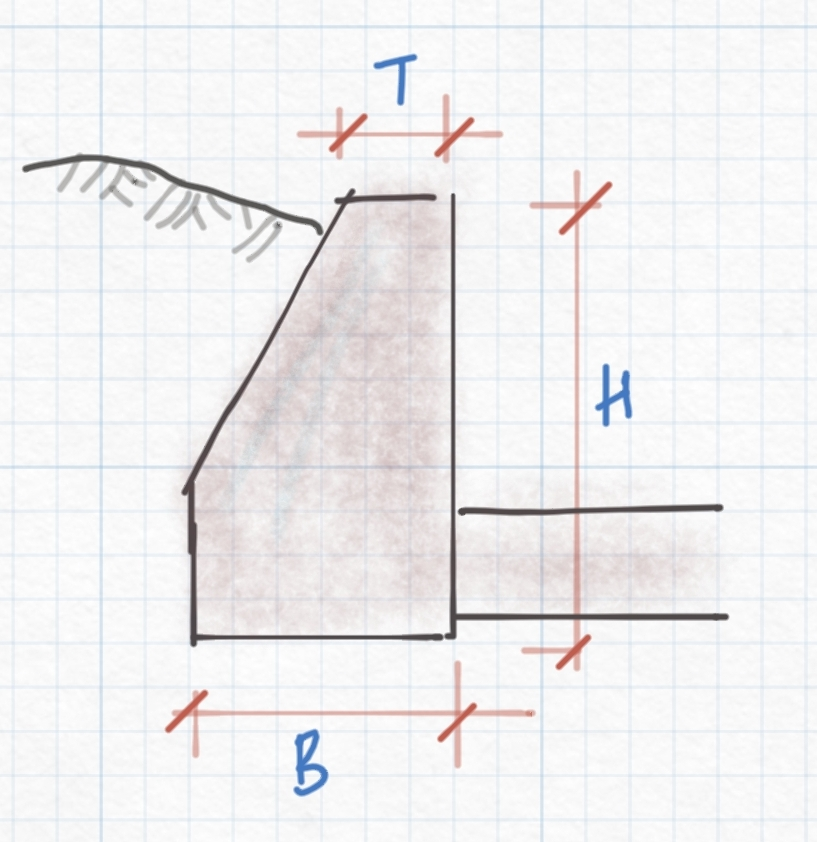

# Design of Regulating Structures

Flow regulating strucrures are a key component of a canal network system. They are provided at different points along canal routes to provide adequate control of flow condition during conveyance of irrigation water to different parts of the irrigation area. 

CanalNETWROK and ICAD products currently allow the design of Head Regulator Strucures, Cross-Regulator Strucrtures and Inclinded drops. The design of these structures is handled using a dedicated module in the iCAD environment called CanalStructuresJET. To use this module, the structure must first be positioned in the CanalNETWORK environment. The work of canal structures starts, therefore, by positioning and defining locations for the structures along desired canal routes in the CanalNETWORK environment.

# Defining the Structure

To define a location for the structure, insert a floating node that represents a control behavior along a resired canal route in the network system. The most common purpose of floating nodes is to use them as any control, to represent a change in hydraulic condition. 

To insert the floating node along a canal route:

1. Select the route in layout view.

2. In profile view select a segment in the route where you would like to locate the structre.

3. Go to `Workflow > Floating Nodes > Insert New`. This will activate an interactive tool to pick a location with in the segment selected. Pick a location.
   
   
   
   *Insert New menu command.*
   
   You can also edit the location after insertion by using `Workflow > Floating Node > Edit Current`, by first selecting the node.
   
   You can also delete floating nodes from `Workflow > Floating Node > Delete Current`, by first selecting the node.

4. Click on the floating node just inserted to select it, and go to `Workflow > FLoating Node > Canal Structures...` to define the strucrure. 
   
   
   
   
* User Tag or Name: specify the name of the individual structure that can adequately identify the structure properly latter. A standard convention is to use the canal route tag and type of structure, if needed including a serial number. (eg., HR 01 TC_3_12)

* Type of Structure: The type of structure the floating node represents. Select from the available list (select the proposed structure of interest either cross regulator, head regulator or inclined drop).
  
  <u>Cross Regulators</u>: structures that are located on parent canals at a position some distance downstream of an off-taking branch canal. They are used to regulate head of flow in the parent canal, so that required amount of water flows to the branch canal. Often, their crest level is set the same as the canal bed level), Head regulators.
  
  <u>Head Regulators</u> are structures posited on branch canals. They usually have their crest levels raised in proportion to the expected overflow discharge rate.
  
  <u>Inclined drops</u> are energy dissipating structures located along canals. These drops can be designed as special structures - in contrast to regular vertical drop structures - with proper consideration for surface and subsurface hydraulic conditions.
  
  *Edit Variable dialog for New Canal Structure.*
  
  The dialog also allow to input a user specificied name that can be used to identify the control structure on plan views, or BoQ generation.
  
  * Next Action: The proposed action to execute upon hitting `Apply` Button.  During definition, this option can be left to default setting (Do Nothing.)
  5. After selecting the structure type, and providing an identifier name as above, hit `Apply` button to save the data. 

> Note: For Inclined drops, automatic check applies if drop height is sufficient for an effective energy dissipation upstream energy grade line (US.EGL) is sufficiently greater than the downstream energy grade line (US.EGL) if not, a message is displayed and check the exit drop and try again. Similarly, if the head loos not sufficiently defined the right message displayed for cross and head regulator and feed the value greater than 0.1m.

![[  ]](Images/Image%20004.png) 

*Dialog promoting invalid action for inclined drop design.*

## Designing the Canal Structure

Before proceeding to design, make sure to save the modified data of the network to the Network Host object of choice. Failing to do so will make the data unavailable for iCAD.

To start the design process for canal strucrues defined as above, start iCAD if not already started. Then define a session using the dedicated module *CanalStructuresJET*. To do so:

1. Go to `Workspace > New Session`. The *Module Browser* dialog will apear. 
   
   ![[  ]](Images/Image%20005.png) 
   
   *Module Browser dialog.*
   
   You can also start from the push menu item shown below.
   
   

2. Choose *CanalStructuresJET module* and hit `Continue`. This will invoke the *Jump Design* editor dialog. Note, all structures addressed for designed in the workflow under discussion involve the analyisis of hydraulic jumps, hence the name for the editor.
   
   
   
   **Note: You can select a flow section object in AutoCAD to start designing tentative (that is not bound to any canal route) structures.**

3. Click on the space for *Network Host Object* variable, and AutoCAD will be in select mode promoting to select a network host object. Pick the host object where the network data, including the definition of structures, is saved to and hit the continue button `>>`.
   
   Note: Step 2 and 3 may be skipped by using the *Next Action* variable setting discussed earlier (Defining the structure) to *Point to Current*.
   
   Note: The dialog will remember previous selections of host entity, and may display an object ID. Click on it to change it.

4. The *Choose Structure* dialog will apear. In the dialog,  you will see a list of structures saved to the current host object. Choose your desired structure, and click `OK` to proceed with design. 
   
   ![[  ] ](Images/Image%20007.png)
   
   *Dialog to choose a strucure, to contunue with design work.*
   
   If the structure is called for the first time, iCAD will begin the design session by using the set default values. Else, a *Choose Startup Option* dialog apears to allow users to decide how they want to proceed. Users can start design process afresh, or continue from previous design work.
   
   ![[ ]](Images/Image%20008.png) 
   
   *Start-up option dialog.*
* Use Design Data option to continue from previous design data saved to the data base.

* Start New Design option to start the design process afresh.
  
  Note: If a pointer is set in CanalNETWORK, iCAD will always choose the structure to work on from the setting. Use *Clear Pointer and Exit*, and click `OK` to clear pointers, to be able to select a different structure.

## Editing Variables

The iCAD environment is now ready for detailed design work, displaying the section view for the structure (Face-upstream-direction), and differnt annotated settings along with it.

![[  ] ](Images/Image%20009.png)

*iCAD environment showing initial view of the strucrure for an inclined drop design.*

The module allows you to work on your design in transverse view, in longitudinal view and in plan view. Different structural and hydraulic conditions are considered in the different views. In line with this, you can edit different sets of variables in each view. By default, the design module starts with the transverse section view. Follow these steps to proceed with design:

1. Edit Variables
   
   To define specifc design variables for your structure, go to `Workflow > View Varibela Editor`. 
   
   ![[  ]](Images/Image%20010.png) 
   
   *View Variable Editor menu command.*
   
   This will invoke the variable editor dialog with detailed variables relevant to the current view.
   
   ![[  ]](Images/Image%20012.png)
   
   *Variable Editor for transverse view*
   
   <u>Coeficient of Discharge</u>:  The value of Cd in governing equation, set by default to 1.710. A value greater or equal to 1.0 is expected.
   
   Q= C L H^(3/2)
   
   <u>Calculation Method</u>: The method of overflow rating curve calculation. Please see technical details for more on this. By default, this is set to *Use User Input Cd*

> Note: You can only specify the Ogee method for Hear Regulator (HR) Structures. This is because the crest height is set to zero by default for CR and ID.

   <u>US/DS Angle and Length of Abutment</u>: Specify the layout of the structure in plan view, dictating how long and wide the abutment provisions must continue upstream and downstream

   ![[  ]](Images/Screenshot_20220127-151419_Concepts.jpg) 

*Layout of a typical canal structure showing dimensions for abutment provissions.*

   <u>Total Longitudinal Length</u>: The total length of the structure measurered from begining of upstream appron, to end of downstream appron.

   <u>Length of Approach Section</u>: The length of upstream impervious floor required for the structure before the control section and to the begining of the upstream appron.

   <u>Abut. Wall Width</u>: The top thickness of the abutment wall to be provided, and B/H ratio to use in determining the thickness of the wall at the foundation level (applied for BoQ estimation.)

 

*Abutment wall dimensions for structures*

   Applying the changes to the variable editor, will make the necessary adjustments on the transverse view. It also recalculates the overflow rating curve in preparation for the design and analysis involved in the longitudinal view.

2. Edit variables. 
   
   Yes, the next step is also to edit more variables. This time, it will be for the longitudinal view. Change the view from `Workflow > Next View`. The longitudinal view of the structre is diplayed, again using default settings. Edit variables as needed.
   
   ![[  ]](Images/Image%20013.png) *Variable Editor listing the variables relevant to the longitudinal view*
   
   <u>Minimum Appron Thickness</u>: The minimum applicable appron thickness for the structure, set by default to 0.40m.
   
   <u>Jump Mechanism</u>: This specifies what type of energy dessipating mechanism to use in the stilling basin area of the structure. There are three options: (a) SImple basisn, (b) USBR Type II and (c) USBR Type IV basins. 

> Note: Changing the eneergy dessipating mechanism will automatically force some changes on the stilling pool depth.

   <u>Pool Depth</u>: The depth of the stilling pool measured from the exit level (bed level of the downstream canal) to the lowest point in the stilling pool. Set by default to 0.10m or other similar value depending on the energy level.

   <u>US/DS cutoff Depths</u>: specify the depth of the upstream / downstream cutoff walls for the strucrure.

> Note: The thickness of the cutoff walls is set equal to the minumum appron thickness value above, or 0.40m by default.

   <u>Allowable Excess Energ</u>y: prescribes the minimum and maximum undesipated energy that can be allowed downstream of the structure. This latter is theoretically desired to be zero, but one can specify in the range of 0.05 to 0.10 for practical purposes.

   After making the necessary changes, hit `Apply` and the drawing will change to reflect the new settings.

## Working with the Module

The module offers differnt functionalities for the engineer to design and document a well defined structure. The following are common:

### Interactive sizing

Click on any bold (green or red) colored graphic element, and you will find an interactive tool to reposition that particular component of the structure. This is available:

* both upstream and downstream cutoff walls, used to increase or decrease the depth of the walls.

* Stillin pool level to raise or lower the depth of the stilling pool.

* Inflection point for bottom profile of downstream appron (available only for HR/CR, and where adequate variations in unbalanced hydraulic gradient exist.)

![[  ]](Images/Image%20019.png) 

*Interactive sizing tool showing drag feature for downstream cutoff depth.*

### Changing views

The module undertakes design works in longitudinal and transverse views. To access these views simply go to `Workflow > Next View`. This menu command will change the view as follows:

- if current view is transverse section view (face upstream), the the command will change the view to longitudinal section view.

- if current view is longitudinal section view, the command will change the view to transverse seciton view. 

A third view is the plan view. In this view, the arrangement of the different components of the structure in the x-y direction (from top view) are displayed. To generate the plan view, go to `Workflow > Plan View`.

Sample views are inclued in following section.

### Changing Energy Dessipation Mechanism

This is important as the performance of the structure depends largely on the abiilty of the provisions for the structure to efficiently and adquately dessipate any excess energy with in the confines of the structure. Depending on the amount of excess energy reaching and leaving the stilling pool, the user can vary the provissions to come to an acceptable design.

Every time, the mechanism is changed, the longitudinal view will also change to reflect the new changes. 

> Note: Type I stilling basin provides a suitable pool depth value. When changed to Type II, the pool depth will be fixed to a prescribed value that depends on the unit discharge and energy difference. Accordingly, baffle blocks and pool-end blocks are provided. When changed to Type IV, the pool depth is forced to zero, and baffle blocks are provided at downstream end of the glacis.

The following schematics show the resulting flow profile and stilling basin arrangement for the three types of energy dessipating mechanisms.

![[  ]](Images/Image%20020.png) *Schematic of a simple (Type I) Energy dessipating mechanism.*

![[  ]](Images/Image%20021.png)

*Schematic of USBR Type II Energy dessipating mechanism, showing longitudinal section and plan views respectively.*

*Schematic of USBR Type IV Energy dessipating mechanism, showing longitudinal section and transverse face-upstream view*

## Changing Hydraulic and Location conditions

As design continues, it may be necesary to change the position of a structure, or the hydraulic conditions upstream or downstream. If such changes are made to the floating node, or to the canal segments upstream and downstream of the floating node, then these new changes must be applied to the saved data. To do this:

1. Select the node representing the strucrture

2. Go to `Workflow > Floating Nodes > Canal Structures...` 

3. Simply hit `Apply`. This will update the currently existing poisiton and hydraulic conditions for the structure.

Then, opening the structure in iCAD's *CanalStrucutreJET* module will come with the new set of conditions.

### Bridge Decks

The user has the option to provide a bridge deck for the strucure(s). To do this, go to `Workflow > Bridge Options...` 

This will start the Edit variables dialog, listing the following variables:

<u>Number of Piers</u>: The number of supporting piers between the left and right abutment walls of the strucure. A value of 0 is acceptable for no piers.

<u>Type of Piers</u>: Specify one of four types of piers. The shape of the applied piers can be visualized in plan view.

*Type I, II, III and IV pier sections used in the module.*

<u>Downstream Length</u>: The length of the pier walls extending in to the downstream flow area, measured after the end of the crest. The software calcualtes and suggests a value.

<u>Bridge Deck Thickness</u>: The desired thickness of the bridge deck.

After hitting `Apply` all the changes will apply to both the longitudinal and transverse views.

If no bridge is required after setting values, simply go to `Workflow > Clear Bridge Settings.` This will clear all information on bridge deck as well as from the views.

### Plan View

The plan view tool provides a complete detaii of the components of the structure - e.g., abutment walls, overflow area, stilling pool - and their arrangements relative to each other. To generate plan view:

1. Go to `Workflow > Plan VIew` When prompted review the default title and scale. 
   
   Lateral exageration Scale: is used to stretch the drawing in the lateral direction when creating the componens. This may be required for overlaying the drawing on existing canal route plans. (See sample drawing generated with LX=1.0 further below)
   
   Hit `Ok`, and this will generate the plan view, and prompt for orientation.

2. Choose desired orientation: 

North Free: aligns the centerline of the structure to the horizontal axis.

North Up: aligns the north symbol to the y vertical axis.

> Note: each view can be exported to AutoCAD for further editing and production as needed.

*Plan views generated showing for North-UP, and North-Free options of the same structure.*

The drawing below shows a snapshot from AutoCAD environment, where the parent canal is shown with an HR structure, whose plan is generated at the same lateral exageration scale as the route plan drawing.

### Saving Design Work

Design work can be saved at any stage during the design process. Simply go to `Session > Save`. This will display a progress dialog, and save the data to the host object. 

The next time the project is opened, the user has the option to continue from the existing design data, or start afresh.

### Generating BoQ

BoQ can be easily generated for all structures designed using this module CanalStrucrturesJET. The first task should be to review the BoQ generation settings from `Workflow > Edit BoQ Settings...`.

<u>Cut Slope</u>: The cut slope to be used in estimating excavation works

<u>Height Buffer</u>: Height of buffer area to consider for volume calculation

<u>Working Space</u>: Space to consider arround the structure, in addition to the true footprints of the structure.

Once the settings are verified, then start the estiamtor from `Workflow > Estimate BoQ`. The BoQ is generated.

A complete BoQ listing can be generated from `Workflow > Estimate BoQ...` menu command.

This will extract and report the estiamated bill of works for the structure, similar to the one shown below.

Often, a number of structures are designed for different canal routes in the network, and the BoQ may be required in one report. To create BoQ all structures in a host, use `Session > BoM Extract`. When prompted, choose the network host object .

This will generate the BoQ for all structuers in the host. Notice the difference in the header texts for multiple structures.

> Note: 
> 
> * For this step to work, the BoQ for all the structures must have been extracted, and saved. 
> 
> * Remember the network host object points to the data set of the entire network, including the structures designed using CanalStructuresJET.
> 
> * The JET dialog will rememeber the last host selection. To change it, click on the value cell, and select a desired host object.

### Generating Longitudinal Drawings

The user can export the different views of the structure, and along with it the designed elevations, to AutoCAD. The procedures are documented in iCAD product documentation in detail.

1. Change to the view you want to generate, either longitudinal, transverse or plan view. Zoom and Pan as desired to focus the output to the drawing area.

2. Then go to `Workflow > Render to AutoCAD`. 
   
   

3. Choose *Copy BBox*, and hit `Ok`. 
   
   

4. Choose *Plot to BBox* option, and hit `Continue`.
   
   

5. Choose *Plot Extents* option, and set the desired plotting scale. Do not leave this to the default value of *All*, or the generated drawing may not be of equal scaling in x and y direction.
   
   This will generate the plot area corresponding to the positioning in iCAD interface view.
   
   

6. Repeat the step from `Workflow > Render to AutoCAD`, and this time select the elements you want to generate. You can also use the `Select All` button to select all components. Also make sure to check *Limit Plot to Range* box. Then hit `OK` button.
   
   

7. AutoCAD will be in select mode. Pick the diagonal object created in step 6 as a reference object. The drawing will be recreated in AutoCAD environemnt.
   
   

END.
