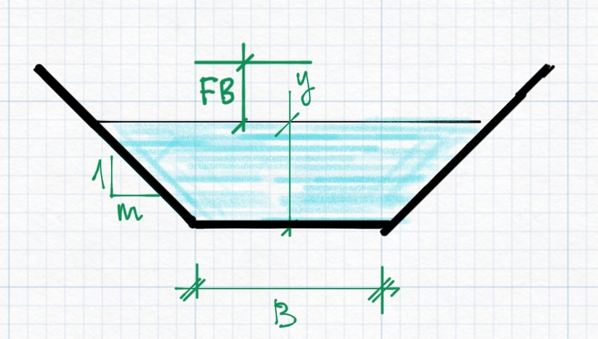
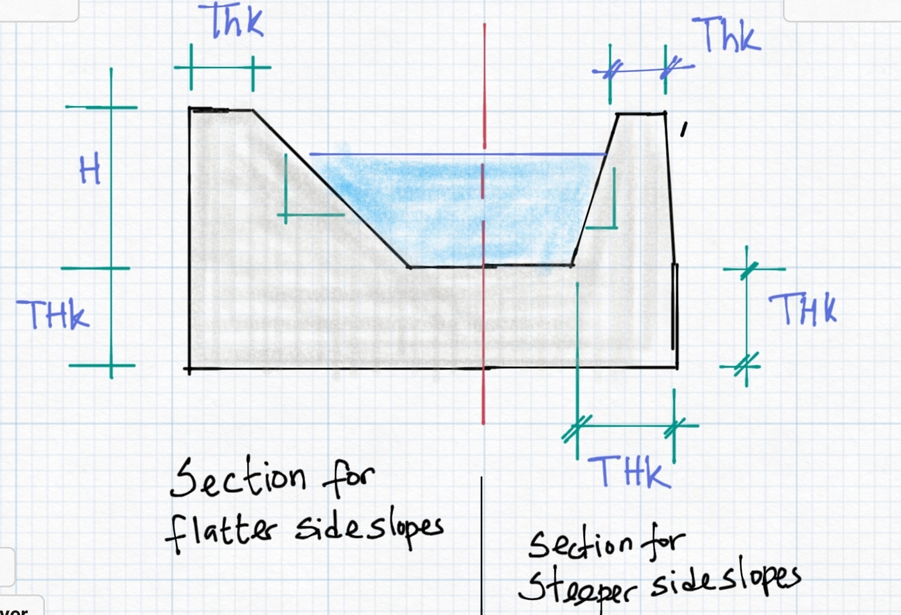
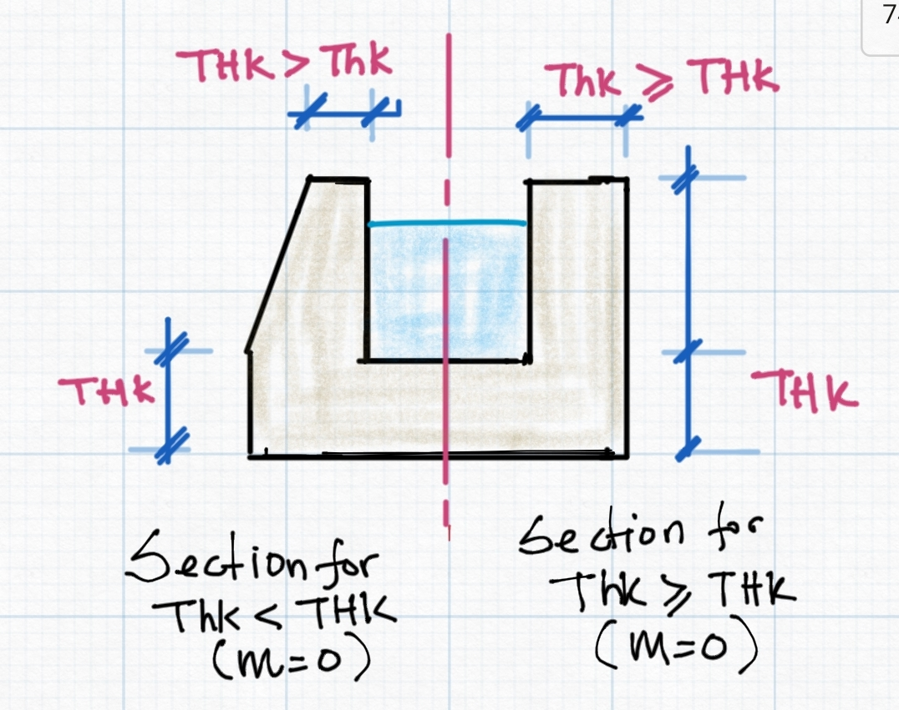

# Design of Canal Flow Sections

Hydraulic design of canal flow sections is a key and often implemented process both in iCAD (especially CanalManning module) and CanalNETWORK products. In the latter case, it also establishes the basis for all the subsequent design, analysis and documentation tasks. This section describes the implementation of the methodology as used in the products.

## Usage

Software products tackle canal routes by breaking them down in to segments. Canal segments are portions of a canal route that are posited between two control structures (also known as nodes.) 

The solution for dimensions of a flow section are required in each of these canal segments, in order to establish the basis for subsequent design tasks including design of structures, BoQ estimations, drawing generation to AutoCAD. The following describes the approach used in this algorithm.

## Manning's Equation: The basis

The design of flow sections - i.e., the determination of the dimensions of canal sections - is carried out by solving the mannings equation.

F(y)= Q= (1/n) AR^(2/3) S^(1/2)

For given values of:

* Discharge caapacity passing through the canal

* Bed slope of the canal segment.

* Mannings Roughness coeficient

* Canal side slope value

In addition, practice dicated values - also read from design criteria or user override inputs - are used to determine the final shape and size of the canal section as follows:

* B-to-D ratio

* Free board

* Lining Thickness

## Design of the wetted area of the flow section

Determining the actual wetted flow area is the first solution the algorithm seeks to determine. To achieve this we solve the equation

f(y)=Q-(1/n) AR^(2/3) S^(1/2)=0

where y is the variable of ineterst.

The equation is solved numerically to precisely determine the anticipated flow depth in the canal segment. The approach is described in the flow chart shown below.

![[  ] ](Images/Flowchart.jpg)

*Flow chart depicting the algorithm implementation for designing canal flow sections.*

The above solution depends on a setting for the variable b-to-d ratio. This value is initially set in the design criteria set, and is made available for design of each level or generation of canal in the network. The value can be set as either:

* a constant value, depicting to maintain a constant ratio between the flow depth and bottom width of the designed canal section. A value between 1 and 10 (inclusive) are acceptable. 

* an equation of the form b2d=  1.76 Q ^0.75, where Q is the discharge capacity, For Q<=0.2, a value of 1.0 is used.
  
  

* lookup in a table of values that can be represented as the following chart. Values for a given discharge are determined by method of non-linear interpolation.

![[  ]](Images/b2dvsq.png) 

> Note: For any discharge values exceeding the limits of the above chart, B-to-D ratio is estimated by non-linear extrapolation.

The algorithm returns a the flow depth y, and the bottom width of the canal section B, to the calling functions. This establishes the size of the wetted flow area in the canal section.

## Design of Free Board

The freeboard provission, along with the flow depth and bottom width, determine the final shape and size of the flow section. The setting for this parameters is also set as part of the design criteria listing, and applied for each level or generation of canal section. 

The value can be set as:

* a constant value, which representing the actual freeboard depth for the canal segment.

* lookup from a built-in table of values for Q vs FB, that can be represented as the following chart. The value for a given discharge is determined using non-linear interpolation.

![[   ] q vs fb chart](Images/fbvsq.PNG)

> Note: For any discharge values exceeding the limits of the above chart, FB magntitude is estimated by non-linear extrapolation.

The value determined from this value is added to the earlier determined flow depth, to specifiy the total height of the canal designed.

## Lining provision and types

The products allow users to specify lining types to provided the desired size and dimension of protective lining for the entire reach of the canal segment in question. Settings for canal lining parameter are also found in design criteria set, and applied to each canal route depending on the level of the canal.

Canal linings can be specified as one of three valiues. Thus:

* <0, typically -1, for no lining

* =0, for thin linings. In this case the thickness of the lining will be made equal to the value set for the variable *Thk*.

* greater than 0, typicall 1, for thick linings. In this case the values set for the variables *Thk* and *THK* are used to determine the shape and size of the lining.

The three linings are schematically presented as shown below.

![[  ]](Images/Lining0.jpg) 

*Schematic diagram of a thin lining provission for a canal section*

 

*Schematic for a thick lining provission, representing section geenerated for flat and steep canal side slopes depending on the values set for Thk and THK values.*

 

*Schemaric showing lining shape generated for thick lining depending on the comparative values of Thk and THK for a vertical side wall (m=0)*

## Design for Constuction Dimensions

Results of design from the above mentioned steps and procedures often give theoretical values that are not suited for construction. It is often required that values are practical, and meet precision levels achievable during construction.

In CanalNETWORK, the variable in preferences can be set to force determination and use of such values in design, estimation and drawing generation, by setting a value >=0.05. 

This settings forces all bottom width values, determined from Canal section design process, are rounded to the nearest multiple of values. For example if 0.05 is set, a width value of 0.83 will be forced to 0.85, and a width value of 1.22 will be forced to 1.20.

Following these roundoff adjustments, the canal section is re-designed to determine the resulting flow depth, and the final designed section corrected accordingly.

END.

