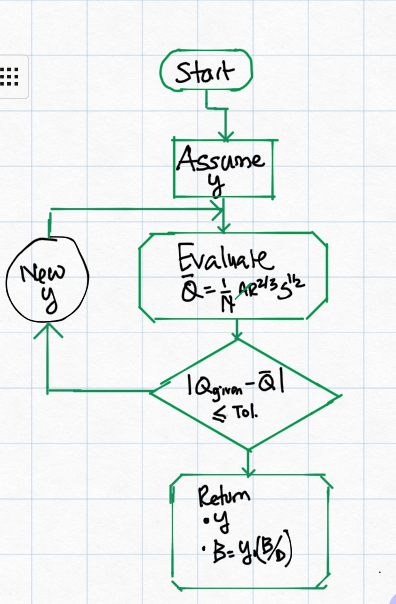
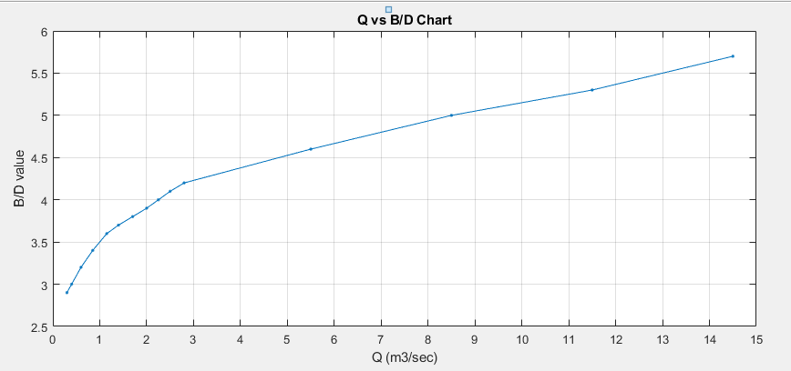

# Design of Canal Flow Sections
[Back to Home](..\index#online-documentation)

<!---
[ ] Supress Vcrt for lined canals in canal performance text, and hover tooltip
[  ] Change Kenedy slope on image below.
[  ] Supress Solve for Tau in uiCanalSectionDesign interface (Solver option)
[ x ] Comment out (DO not remove) shields criteria from manual
--->

## Table of Contents

<!--TOC-->
  - [Introduction](#introduction)
  - [Usage](#usage)
  - [Lined Canals design](#lined-canals-design)
  - [Unlined Canals Design - Kenedy's Method](#unlined-canals-design-kenedys-method)
  - [Unlined Canals - Lacey's Method](#unlined-canals-laceys-method)
  - [Special Design Considerationa](#special-design-considerationa)
    - [Design of the wetted area of the flow section](#design-of-the-wetted-area-of-the-flow-section)
    - [Design for Maximum Safe slope](#design-for-maximum-safe-slope)
    - [Design for Constuction Dimensions](#design-for-constuction-dimensions)
<!--/TOC-->
## Introduction
[Back to ToC](#table-of-contents)

Hydraulic design of canal flow sections is a key and often implemented process both in iCAD (especially CanalManning module) and CanalNETWORK products. In the latter case, it also establishes the basis for all the subsequent design, analysis and documentation tasks. This section describes the implementation of the methodology as used in the products.

## Usage
[Back to ToC](#table-of-contents)

CanalNET Software product tackle canal routes by breaking them down in to segments. Canal segments are portions of a canal route that are posited between two control structures (also known as nodes.) 

CanalNET software sizes canals for a given discharge and material conditions **automatically**. This meanse, the user does not solve for section dimensions. The role of the user is to decide on independent variables such as:
- bed slope
- allowable velocities and shear stress
- the desired shape and proportion of the canal
- the design method to be applied,
- and the likes.

*Figure: Showing key variables in the design criteria set that influence the design of canal sections.*

The design is carried out using the specified method and using a wide array of relevant data available from the canal network file. These data include farm duty, command area, slope and bed material, as well as threshold values such as limiting velocities and shear stress values, and many more.

These are defined early in the project modelling phase as part of the design criteria. However, the software allows for modification of these parameters at segment level, allowing flexible use to model various site specific conditions in the design process.

## Lined Canals design
[Back to ToC](#table-of-contents)

Lined canals are specified by setting the *Lining Type* variable to a value of 0 or 1, representing thin and thick linings respectively. The design of flow sections - i.e., the determination of the dimensions of canal sections - is carried out by solving the manning's equation.

    F(y)= Q= (1/n) AR^(2/3) S^(1/2)

For given values of:

* Discharge capacity passing through the canal

* Bed slope of the canal segment.

* Manning's Roughness coefficient

* Canal side slope value

In addition, some values that are dictated by local practice determine the shape and proportion of the resulting canal section. These include:

* B/D  (B-to-D ratio)

* Free board

> **Important Tip:** Refer to the chapter [About Design Criteria](..\DesignCriteria\AboutDesignCriteria#about-design-criteria) to learn about specific guidance on and understand how B/D and Freeboard values are set, and how they impact design.

For lined canals, B/D values are determined as follows:
- B/D= -1 
    B/D= 0.03Q+1.0, Q>0.20m3/sec

- B/D=0 
    B/D values are read from (builtin) Tables of Values 

- B/D > 0
    B/D is the specified value.

## Unlined Canals Design - Kenedy's Method

[Back to ToC](#table-of-contents)

Unlined canals are represented by setting the *Ltype* variable value to -1. The user can choose to consider Kenedy's method of alluvial canal design by setting B/D values >=-1.

> **Tip:** Refer to the chapter [About Design Criteria]() to learn about specific guidance and understand how B/D and freeboad values influence design.

> **Tip:** Recall B/D values can assume values -2, -1, or any value >=0 and <=15.

In summary, for unlined canals:
- B/D= -1
    B/D=1, Q<=0.20m3/sec, 
    B/D= 1.76Q0.75, Q>0.20m3/sec

- B/D=0
    Uses the built in table (Fig 2)

- B/D > 0
    B/D assumes given value, and B/D<=12

Under these conditions, the canal section design is carried out using the following relation ships:

   

 where:
 - V is the mean velocity in the canal section
 - Vcrt is a criteria velocity (Kenedy's relationship), and 
 - Vc is Chezy flow velocity.
    
 The variables involved are:
 - n is manning's roughness coeficient
 - R is hydraulic radius
 - S is the user defined canal bed slope
 - D is flow depth in the canal, 
 - C is chezy constant.

The sizing of the canal is typically carried out using the mean velocity equaition above, and hence essentially manning's equation. The solution for the Kenedy's equation are presented in the following sections of the user interface.

   

   *Figure: Showing calcualted slope for a canal segment that fulfils the condition Vcrt/V~=1.*

   

   *Figure: Showing calculated mean velocity and criteria velocity (according to Kenedy's method) on a canal segemtn.*

## Unlined Canals - Lacey's Method

[Back to ToC](#table-of-contents)

Unlined canals are represented by setting the *Ltype* variable to a value of -1. To use Lacey's method of canal section design, the user should set B/D values to -2. The following equations are used to determine the canal size and related bed slope.

where:

- Q is discharge, m3/sec
- V is mean velocity (Lacey's equation)
- P is wetter perimeter
- R is hydraulic radius.
- d~mm~ is mean diameter of canal bed material (mm)
- f is friction coeficient
- S is Lacey's slope.

Specifying Lacey's method (by setting B/D=-2) ensures that a canal section meeting Lacey's requirements are provisioned by finding the right B/D value.

The desirable slope to fulfil lacey's condition is also shown on the slop list box as shown in below figure.

## Special Design Considerationa
There are few ways to handle special design considerations that may be needed when working with projects. These are presented below.

> **Note:** The following methods are applicable in indicidual canal segments, and can not be applied for entire networks using design criteria settings.

### Design of the wetted area of the flow section
[Back to ToC](#table-of-contents)

Determining the actual wetted flow area is the first solution the algorithm seeks to determine. To achieve this we solve the equation

f(y)=Q-(1/n) AR^(2/3) S^(1/2)=0

where y is the variable of ineterst.

The equation is solved numerically to precisely determine the anticipated flow depth in the canal segment. The approach is described in the flow chart shown below.

*Flow chart depicting the algorithm implementation for designing canal flow sections.*

The above solution depends on a setting for the variable b-to-d ratio. This value is initially set in the design criteria set, and is made available for design of each level or generation of canal in the network. The value can be set as either:

* a constant value, depicting to maintain a constant ratio between the flow depth and bottom width of the designed canal section. A value between 1 and 10 (inclusive) are acceptable. 

* an equation of the form b2d=  1.76 Q ^0.75, where Q is the discharge capacity, For Q<=0.2, a value of 1.0 is used.
  
  

* lookup in a table of values that can be represented as the following chart. Values for a given discharge are determined by method of non-linear interpolation.

> Note: For any discharge values exceeding the limits of the above chart, B-to-D ratio is estimated by non-linear extrapolation.

The algorithm returns a the flow depth y, and the bottom width of the canal section B, to the calling functions. This establishes the size of the wetted flow area in the canal section.

### Design for Maximum Safe slope
[To be completed]

### Design for Constuction Dimensions
[Back to ToC](#table-of-contents)

Results of design from the above mentioned steps and procedures often give theoretical values that are not suited for construction. It is often required that values are practical, and meet precision levels achievable during construction.

In CanalNETWORK, the variable in preferences can be set to force determination and use of such values in design, estimation and drawing generation, by setting a value >=0.05. 

This settings forces all bottom width values, determined from Canal section design process, are rounded to the nearest multiple of values. For example if 0.05 is set, a width value of 0.83 will be forced to 0.85, and a width value of 1.22 will be forced to 1.20.

Following these roundoff adjustments, the canal section is re-designed to determine the resulting flow depth, and the final designed section corrected accordingly.

[Back to ToC](#table-of-contents)

END.

