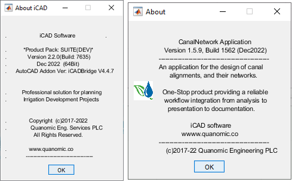
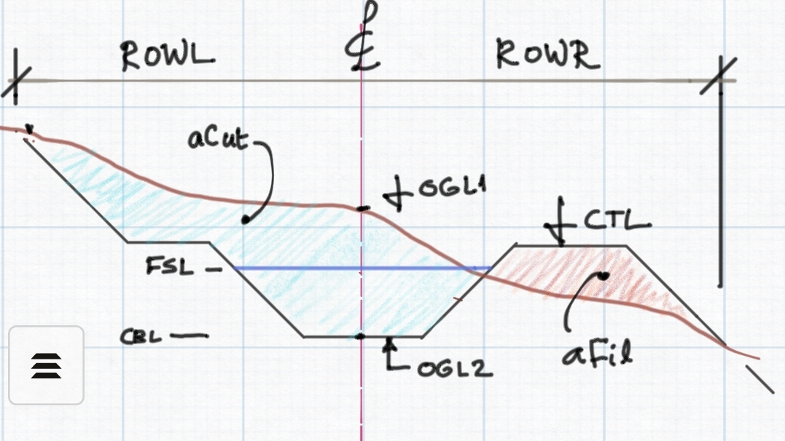

## **Hi Everyone,**

Well come to our latest release including updates for **Oct-Dec 2022** . As always, we are excited to bring to you many enhanced features and functionalities to our products, building on our innovation and experimentation of different use cases as well as user feedback. 

Further to great improvements and additions in previous release of Sep2022, this latest update for this period, includes - among others - the bekow listed key features and functionalities.

Happy Designing,

Team Quanomic.

### Download files:

Alway make sure you are working with the updated versions of our products. To update your software to the recent release.

Download these resources below and follow the usual procedure to update your products.

*Note: The download links will take you to a goole drive link. Go to the top right of the page, and choose download to get the files.*

- [Download iCAD 2.2.0.7635 - Google Drive](https://drive.google.com/uc?export=download&id=1iwZkS-dC8lcyAM_GfTrUcoXKIsxTY6mM)

- [Download iCAD bridge - Google Drive](https://drive.google.com/uc?export=download&id=1CnTmhM2ddaukULOwKaNiBN3WnqLzTXWC)

- [Download CanalNetwork 1.5.9.1562-Google Drive](https://drive.google.com/uc?export=download&id=1m7joxCNDvkxZgRPiAq5k1UG57J9aOYWH)

> Caution: The above files are only update files. A lincensed and working version of both products is required on a host computer for the updates to function. Contact us if you would like the installation files.

-----------

## Major updates and funtionalities

Major feature updates and functionalities for this release include:

- Bigger Detail view is now available from the view manager menu command, allowing to see details of cross-sections and junciton nodes comfortably.
  
  

- Additional data safety feature (accesible from iCAD) is incuded to overcome basic object property issues in AutoCAD system. This can only be set once. If an object is sel already, the original is maintained.

- New tool -accesible from iCAD - is introduced for using the newl production sheet layout we proposed from CAD Tools menu (an experimental release).
  
  

- All reports and BoQ extracts are now generated to the project folder, where the AutoCAD file resides.

- New function to over ride canal route capacity, to account for rotational water supply options that may be required on certain canals.

* New function to automatically reverse canal route alignments in AutoCAD, in preparation for network resolution and profile extraction.

- New feature for editing Auto-generated farmblocks in AutoCAD and updating workspace data.

- Improved subroute selection feature, to handle route selections flexibly for various tasks. The use can now specify explicitly which levels of sub-routes to select for further processing- for instance, BoQ generattion, Drawing production, or Design Criteria (Discharge) override.
- Improved canal top provission specification, allowing to automactically position provissions depending on natural gradient. This eliminates the need for the user to specify conditions for each route one by one, contributing to design speed and saving much time for the designer.
- Improved canal route exception handling and management, allowing to accomodate specified naming prefix/suffix settings, including provision to provide naming prefix/suffix in reverse order, and accomodate exceptions for naming with prefixes.

* Bug fixes on exception handling, naming texts, and plan view markers orientations.

Previous updates included:

- Improved zoom funcitonality(CTRL+Scroll) for constrained zooming ability
- Up to 7X speed and accuracy on key workflows (Profile generation, Node Identification and resolution)
- Integration some iCAD tools to CanalNETWORK for enhanced design production quality and speed: namely Plan view generation, extended cross-sections and more.
- Improved control of drop design for longitudinal design work
- Improved performance and design production of canal structures: Head Regulators, Cross-regulators, and Inclined Drops.
- A small bug fix on LSec generation (drop scheduling and vertical scaling) for CanalNETWORK product  is included as of Sep29th, 22.
- A bug for profile extraction handling instance objects refering to null data (Oct5th, 2022)
- Visual elements for interactive view, dynamically tracking marker location in profile view to layout view area.
- Allow update of plan view generation data by segments, avoiding the need to update the entire route for small changes. Now user only needs to update the segment where the change was made.
- Summary of BoQ function included to generate highlevel summary of items for similar generation(levels) of canals.
- Natural sorting algorithm included for intutive display of results in Canal Naming, Farmblock tables, and LSec drawing generations.
- Alternate CsV file option for iCAD now included, the same as CanalNETWORK product, allowing data strealining and storage reduction.

END.
